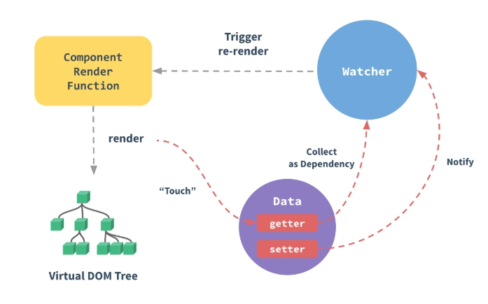

# 響應原理



## 資料驅動

```js
/**
 * 判斷目標變數是否為物件
 * @param {*} target 目標變數
 */
const isObject = function(target) {
  return target && typeof target === 'object';
};

/**
 * 資料和事件觀察者中的依賴橋梁
 */
const Dependency = function() {
  // 一個屬性會配置一個依賴
  // 當屬性質改變時，透過依賴，去通知事件觀察者做動作
  this.renders = new Set();
};

/**
 * 註冊屬性的事件觀察者
 */
Dependency.prototype.add = function() {
  console.log('add');
  // 為每一個屬性的註冊觀察者
  if (Dependency.render) this.renders.add(Dependency.render);
};

/**
 * 通知屬性事件觀察者
 */
Dependency.prototype.notify = function() {
  console.log('notify');
  console.log(this.renders);
  this.renders.forEach(render => {
    // 特意使用 call 作為函式名，讓 Render 和 Watcher 原型都能統一呼叫
    render.call();
  });
};

Dependency.render = null;

/**
 * 事件的觀察者
 * @param {Function} callback 回呼函式
 */
const Render = function(callback) {
  this.callback = callback;
  // 預先做一次
  this.call();
};

/**
 * 事件觀察者執行欲做函式
 */
Render.prototype.call = function() {
  console.log('render');
  // 將事件觀察者暫存至依賴的觀察者
  Dependency.render = this;
  this.callback();
};

/**
 * 將屬性增加 getter 和 setter
 * 使用閉包概念，將 value 變數保存，不論 getter 或 setter 都會去引用它
 * @param {String} key 屬性
 * @param {Object} target 目標變數
 */
const setDefinedProperty = function(key, target) {
  let value = target[key];
  const dep = new Dependency();
  Object.defineProperty(target, key, {
    get() {
      console.log('get：' + value);
      dep.add();
      return value;
    },
    set(val) {
      console.log('set：' + val);
      value = val;
      dep.notify();
    },
  });
  if (isObject(value)) {
    observe(value);
  }
};

/**
 * 將指定物件作轉為 object observe
 * @param {*} target 目標變數
 */
const observe = function(target) {
  if (isObject(target)) {
    Object.keys(target).forEach(key => {
      setDefinedProperty(key, target);
    });
  }
  return target;
};

const person = {
  first: 'John',
  last: 'Doe',
  age: 18,
  : 0,
};
const renderPersonData = observe(person);

// 新增事件觀察者
new Render(() => {
  document.querySelector(
    'h1'
  ).innerText = `My name is ${renderPersonData.first} ${renderPersonData.last}, and I'm ${renderPersonData.age} years old`;
});

new Render(() => {
  document.querySelector(
    'h4'
  ).innerText = `The count is ${renderPersonData.count}`;
});
```

```html
<h1></h1>
<button onclick="renderPersonData.first = 'test'">change name</button>
<button onclick="renderPersonData.age = '20'">change age</button>
<h4></h4>
<button onclick="renderPersonData.count--">-</button>
<button onclick="renderPersonData.count++">+</button>
```

## 資料計算

```js
/**
 * 判斷目標變數是否為陣列
 * @param {*} target 目標變數
 */
const isFunction = function(target) {
  return target && typeof target === 'function';
};

/**
 * 將目標變數轉為計算變數
 * @param {*} target 目標變數
 */
const computed = function(target) {
  if (isObject(target)) {
    Object.keys(target).forEach(key => {
      const value = target[key];
      if (isFunction(value)) {
        Object.defineProperty(target, key, {
          get() {
            console.log('get computed value：', value());
            return value();
          },
        });
      } else if (isObject(value)) {
        const { get = undefined, set = undefined } = value;
        if (get) {
          Object.defineProperty(target, key, {
            get() {
              console.log('get computed value：', value);
              return get();
            },
            set(val) {
              console.log('set computed value：', val);
              set(val);
            },
          });
        }
      }
    });
  }
  return target;
};

const computedPersonData = {
  name() {
    return renderPersonData.first + ' ' + renderPersonData.last;
  },
  counter: {
    get() {
      return renderPersonData.count * 2;
    },
    set(val) {
      renderPersonData.count = val;
    },
  },
};

const computedData = computed(computedPersonData);

// 新增事件觀察者
new Render(() => {
  document.querySelector(
    'h1'
  ).innerText = `My name is ${computedData.name}, and I'm ${renderPersonData.age} years old`;
});

new Render(() => {
  document.querySelector(
    'h4'
  ).innerText = `The count is ${computedPersonData.counter}`;
});
```

## 資料觀測

```js
/**
 * 觀察者的原型
 * @param {Object} data 想觀察的資料變數
 * @param {String} key 目標變數的屬性名
 * @param {Function} handler 欲執行的函式
 * @param {Boolean} immediate 是否立刻執行
 */
const Watcher = function(data, key, handler, immediate) {
  this.data = data;
  this.key = key;
  this.handler = handler;
  this.immediate = immediate;
  this.value = undefined;
  // 第一次設定時，就做執行
  this.update();
};

/**
 * 判斷觀察者是否需立刻做欲執行的函式
 */
Watcher.prototype.update = function() {
  console.log('watch call');
  // 讓 update() 或 call() 中取值時，放入 Dependency 的 renders
  Dependency.render = this;
  if (this.immediate) this.call();
  else this.value = this.data[this.key];
};

/**
 * 執行欲做的函式
 * 特意使用和 Render 原型一樣的呼叫函示名稱
 */
Watcher.prototype.call = function() {
  console.log('watch update');
  const oldValue = this.value;
  const newValue = this.data[this.key];
  this.value = newValue;
  this.handler(newValue, oldValue);
};

/**
 * 將目標變數轉為觀察者變數
 * @param {Object} target 目標變數
 * @param {Object} data 想觀察的資料變數
 */
const watch = function(target, data) {
  if (isObject(target)) {
    Object.keys(target).forEach(key => {
      if (data.hasOwnProperty(key)) {
        let handler = function() {};
        let immediate = false;
        // 物件模式
        if (isObject(target[key])) {
          handler = target[key].handler;
          immediate = target[key].immediate || false;
        }
        // 函式模式
        else if (isFunction(target[key])) {
          handler = target[key];
        }
        new Watcher(data, key, handler, immediate);
      }
    });
  }
  return target;
};

const watchPersonData = {
  age(newVal, oldVal) {
    console.log(`newVal：${newVal}，oldVal：${oldVal}`);
  },
  count: {
    handler(newVal, oldVal) {
      console.log(`newVal：${newVal}，oldVal：${oldVal}`);
    },
    immediate: true,
  },
};

const watchData = watch(watchPersonData, renderPersonData);
```
