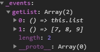

# EventBus

:::tip 說明
主用於 **事件** 傳遞，不含 **值** 的傳遞。
:::

## 事件傳遞

> 利用原生事件

**oldDriver.js**

```js
class OldDriver {
  constructor() {
    this.driver = document.createElement('bus');
  }

  $on(event, callback) {
    this.driver.addEventListener(event, callback, false);
  }

  $off(event, callback) {
    this.driver.removeEventListener(event, callback, false);
  }

  $emit(event, payload = {}) {
    // 觸發成功返回 true
    this.driver.dispatchEvent(new CustomEvent(event, { detail: payload }));
  }
}

export default new OldDriver();
```

**main.js**

```js{10}
import EventBus from '@/extends/oldDriver.js';
Object.defineProperties(Vue.prototype, {
  $eventBus: {
    get: () => EventBus
  }
})
new Vue({
  mounted(){
    // 註冊事件
    this.$eventBus.$on('changeAge', console.log);
  }
  render: h => h(App)
}).$mount('#app')
```

**App.vue**

```js{6}
export default {
  name: 'App',
  mounted() {
    setTimeout(() => {
      // 觸發事件
      this.$eventBus.$emit('changeAge', 30);
    }, 3000);
  },
};
```

## 值的傳遞

> 利用 Vue 的特性

**main.js**

```js{3,11}
import Vue from 'vue';

Vue.prototype.$eventBus = new Vue();

new Vue({
  data: {
    list: [1, 2, 3];
  },
  mounted(){
    // 註冊事件
    this.$eventBus.$on('changeAge', () => this.list);
  }
  render: h => h(App)
}).$mount('#app')
```

**子組件**

```js{4}
export default {
  name: 'About',
  mounted() {
    console.log(this.$eventBus._events['changeAge'][0].apply());
  },
};
```

:::tip 提醒

- 事件的 **命名** 一樣的時候，回呼函式需根據 **索引** 對應相對事件。

  

- 若移除時不指定回呼函式，則 **相同命名** 的事件會一起被移除。
- 若想知道綁定了什麼事件，可以查看 `_events` 這個物件。
  - 在 `_events` 物件中，同名事件會以陣列的方式堆疊。

:::

## 綜合應用

**bus.js**

```js
export default function Bus(vue) {
  // 存放所有 component 的 method
  this.handles = {
    // event: [function, function,...]
  };
  // 存放所有 component的 uid 和 method
  this.eventUidMap = {
    // uid:{
    //   event:[function, function]
    // }
  };
  // 註冊事件
  this.$on = (event, callback, vm) => {
    if (!this.handles[event]) this.handles[event] = [];
    if (callback instanceof Function) this.handles[event].push(callback);
    if (vm instanceof vue) this.setEventUidMap(vm._uid, event, callback);
  };
  this.setEventUidMap = (uid, event, callback) => {
    if (!this.eventUidMap[uid]) this.eventUidMap[uid] = {};
    if (!this.eventUidMap[uid][event]) this.eventUidMap[uid][event] = [];
    this.eventUidMap[uid][event].push(callback);
  };
  this.$off = (event, callback) => {
    if (!this.handles[event]) return;
    // delete object property
    if (!callback) delete this.handles[event];
    else if (callback instanceof Function) {
      let len = this.handles[event].length;
      for (let i = 0; i < len; i++) {
        let cb = this.handles[event][i];
        // delete function
        if (cb === callback) this.handles[event].splice(i, 1);
      }
    }
  };
  // 刪除 component 的 uid
  this.$offByUid = (uid) => {
    let eventObj = this.eventUidMap[uid] || {};
    // 遍遞每一個 event
    Object.keys(eventObj).forEach((event) => {
      // 遍地每一個 event 的 function
      eventObj[event].forEach((cb) => {
        this.$off(event, cb);
      });
      // delete all event
      // delete eventObj[event]
    });
    delete this.eventUidMap[uid];
  };
  // 觸發事件
  this.$emit = (event, ...args) => {
    // return 的資料都丟來這
    // 如果沒 return，則回傳 undefined
    let result = [];
    if (this.handles[event]) {
      let len = this.handles[event].length;
      for (let i = 0; i < len; i++) {
        result.push(this.handles[event][i](...args));
      }
    }
    return result;
  };
  return this;
}
```

**main.js**

```javascript
import Bus from '@/bus.js';

let eventBus = {
  install(vue) {
    let bus = new Bus(vue);
    // 等同是 Vue.prototype.$eventBus = ...
    // 因為要做成唯讀
    Object.defineProperties(Vue.prototype, {
      $eventBus: {
        get: () => bus,
      },
    });
    // 所有的 component，都可以有 mixin 內的功能
    Vue.mixin({
      beforeDestroy() {
        // this 是 VueComponent
        this.$eventBus.$offByUid(this._uid);
      },
    });
  },
};
// 預設會自動把 Vue 傳進去
Vue.use(eventBus);
```

父組件註冊事件：

```js{22,23}
export default {
  name: 'levelOne',
  data() {
    return {
      list: ['html', 'css', 'javascript'],
    };
  },
  components: {
    LevelTwo,
  },
  methods: {
    eventHandler(...arg) {
      console.log(arg);
      console.log(this.list);
    },
    getListHandler() {
      return { list: this.list };
    },
  },
  created() {
    // 新增事件到 event bus
    this.$eventBus.$on('getListHandler', this.getListHandler, this);
    this.$eventBus.$on('eventHandler', this.eventHandler, this);
  },
};
```

子組件呼叫事件和接收資料：

```js{10,11,12,13,14,15,16,17}
export default {
  name: 'levelTwo',
  data() {
    return {
      list: [],
    };
  },
  methods: {
    displayListHandler() {
      this.$eventBus.$emit('getListHandler').forEach((item) => {
        // 沒有回傳值的，會是 undefined
        if (item) {
          Object.keys(item).forEach((key) => {
            if (key === 'list') this.list = item[key];
          });
        }
      });
    },
  },
};
```
