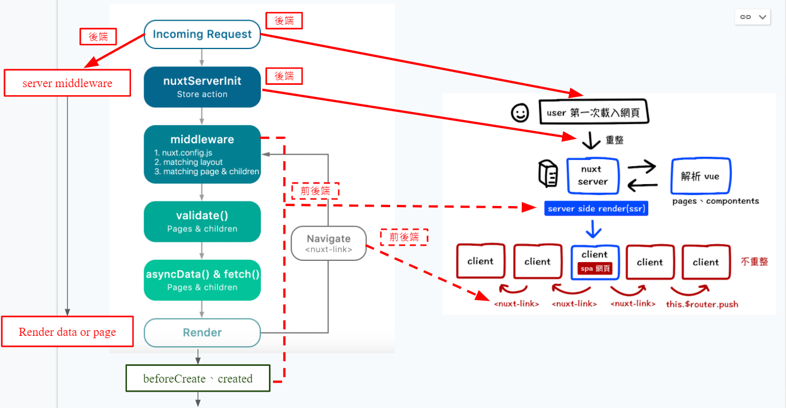
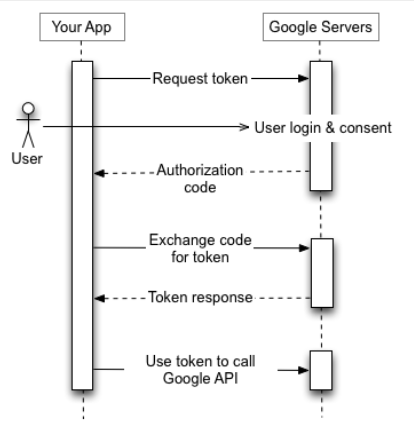
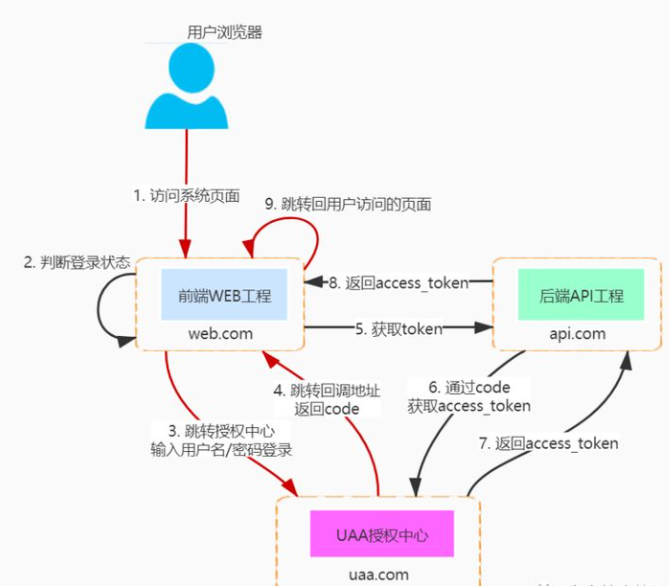

# Server Middleware

借助 nuxt 啟動時的 node server，可以透過它新增其他路由。

```js
// nuxt.config.js

export default {
  serverMiddleware: [{ path: '/api', handler: '~/server/api.js' }],
};
```



## 實做 Google 登入機制

1. 在 Google GCP 「OAuth 2.0 用戶端」設定「已授權的重新導向 URI」，讓使用者完成 Google 驗證程序之後，系統就會將他們重新導向指定路徑

1. 參考下方關係圖，實作 [程式區塊](https://gitlab.com/linche0859/nuxt-course/-/blob/master/server/auth.js)

   

1. 接收回來的 `id_token` 可以透過 `jwt-decode` 進行解碼分析，最後導回指定的路由

   ```js
   import jwtDecode from 'jwt-decode';

   export default {
     mounted() {
       if (this.$route.query.id_token && this.$route.query.refresh_token) {
         let id_token_Decode = jwtDecode(this.$route.query.id_token);
         this.$store.commit('setUserLoggedIn', {
           id_token: this.$route.query.id_token,
           refresh_token: this.$route.query.refresh_token,
           userUid: id_token_Decode.user_id,
           userPicture: id_token_Decode.picture,
           userName: id_token_Decode.name,
         });
         window.history.replaceState(null, null, window.location.pathname);
       }
     },
   };
   ```

## 前後端分離的 OAuth 開發流程



可以參考這篇 [文章](https://zhuanlan.zhihu.com/p/122482859)。
